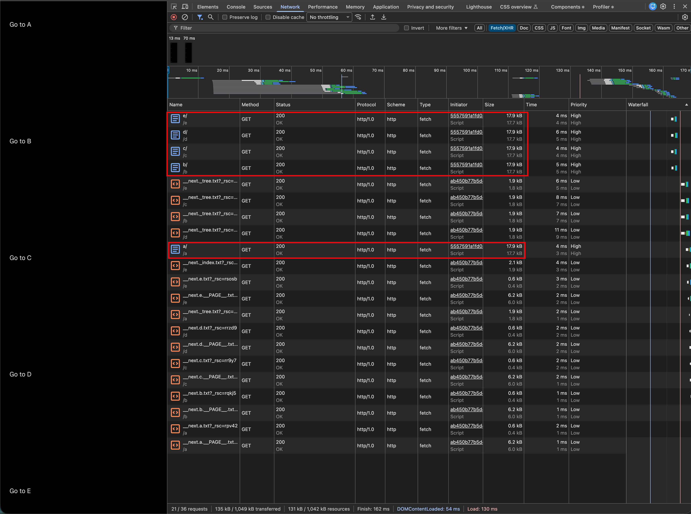

# next-static-export-prefetch-segement-cache

A demo for https://github.com/vercel/next.js/pull/85903

## How to run

```bash
pnpm install
pnpm run build
# Python http.server doesn't have range request support by default, suitable for this demo
python3 -m http.server -d out
```

## Screenshot



## Static Hosting Providers Test

- Cloudflare Pages: https://next-static-export-prefetch-segement-cache.pages.dev/
  - No Range Request Support
- Render: https://next-static-export-prefetch-segement.onrender.com/
  - No Range Request Support

- Netlify: https://next-static-export-prefetch-segement.netlify.app/
  - Range Request Support
